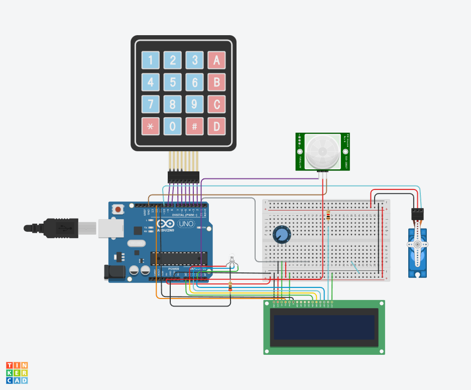

# Smart Door Lock System

A professional Arduino-based security system featuring motion detection, keypad authentication, and servo-controlled door locking mechanism with visual status indicators.



## Table of Contents

- [Overview](#overview)
- [Features](#features)
- [Hardware Requirements](#hardware-requirements)
- [Pin Configuration](#pin-configuration)
- [Circuit Diagram](#circuit-diagram)
- [Installation](#installation)
- [Usage](#usage)
- [System States](#system-states)
- [API Reference](#api-reference)
- [Troubleshooting](#troubleshooting)
- [Contributing](#contributing)
- [License](#license)

## Overview

This smart door lock system provides an automated security solution using Arduino microcontroller technology. The system detects motion via PIR sensor, prompts for PIN authentication through a 4x4 keypad, and controls door access through a servo motor. Real-time feedback is provided via LCD display and RGB LED status indicators.

## Features

- **Motion Detection**: Automatic system activation using PIR sensor
- **PIN Authentication**: Secure 4-digit PIN entry via keypad
- **Visual Feedback**: RGB LED status indicators and 16x2 LCD display
- **Servo Control**: Automated door lock/unlock mechanism
- **Auto-Sleep**: Energy-efficient idle mode after timeout
- **Error Handling**: Invalid PIN attempts with retry functionality

## Hardware Requirements

| Component                | Quantity | Description            |
| ------------------------ | -------- | ---------------------- |
| Arduino Uno/Nano         | 1        | Main microcontroller   |
| 16x2 LCD Display         | 1        | User interface display |
| 4x4 Matrix Keypad        | 1        | PIN input device       |
| PIR Motion Sensor        | 1        | Motion detection       |
| Servo Motor (SG90)       | 1        | Door lock mechanism    |
| RGB LED (Common Cathode) | 1        | Status indicator       |
| Resistors 220Ω           | 3        | LED current limiting   |
| Breadboard/PCB           | 1        | Circuit assembly       |
| Jumper Wires             | Various  | Connections            |

## Pin Configuration

### LCD Display (LiquidCrystal)

```cpp
LiquidCrystal lcd(12, 11, 14, 15, 16, 17);
// RS=12, EN=11, D4=A0, D5=A1, D6=A2, D7=A3
```

### 4x4 Keypad Matrix

```cpp
Row Pins: [9, 8, 7, 6]
Col Pins: [5, 4, 3, 2]
```

### Other Components

- **Servo Motor**: Pin 10
- **PIR Sensor**: Pin A4
- **RGB LED**:
  - Red: Pin A5
  - Green: Pin 13
  - Blue: Pin 0

## Circuit Diagram

The complete circuit schematic is available in the `assets/` directory. The design follows Arduino best practices with proper pull-up/pull-down resistors and current limiting for LEDs.

## Installation

### 1. Hardware Assembly

1. Connect components according to the pin configuration above
2. Ensure proper power supply (5V) for all components
3. Verify all connections before powering on

### 2. Software Setup

1. Install Arduino IDE (version 1.8.0 or higher)
2. Install required libraries:
   ```
   LiquidCrystal (built-in)
   Keypad by Mark Stanley
   Servo (built-in)
   ```
3. Upload the `domotic_door_lock.ino` file to your Arduino board

### 3. Configuration

Modify the PIN in the source code:

```cpp
int correctPin[PIN_LENGTH] = {1, 2, 3, 4}; // Change to your desired PIN
```

## Usage

### System Operation

1. **System Armed**: White LED indicates the system is monitoring for motion
2. **Motion Detected**: Blue LED activates, LCD prompts for PIN entry
3. **PIN Entry**: Enter 4-digit PIN using keypad
4. **Authentication**:
   - Press `#` to confirm PIN
   - Press `*` to clear current entry
5. **Access Result**:
   - **Green LED**: Access granted, door unlocks for 5 seconds
   - **Red LED**: Access denied, system awaits retry

### Keypad Commands

| Key | Function                     |
| --- | ---------------------------- |
| 0-9 | PIN digit entry              |
| `#` | Confirm PIN                  |
| `*` | Clear current PIN entry      |
| A-D | Reserved for future features |

## System States

The system operates in two primary states:

### Idle State

- **LED Status**: White
- **Display**: "System armed" / "Waiting motion"
- **Behavior**: Monitoring PIR sensor for motion
- **Power**: Low power consumption mode

### Active State

- **LED Status**: Blue
- **Display**: "Motion detected" / "PIN: \_\_\_\_"
- **Behavior**: Accepting keypad input
- **Timeout**: Returns to Idle after 10 seconds without input

## API Reference

### Core Functions

#### `setLed(uint8_t mode)`

Controls RGB LED status indication

- `LED_OFF`: All LEDs off
- `LED_WHITE`: System armed (idle)
- `LED_BLUE`: Motion detected (active)
- `LED_GREEN`: Access granted
- `LED_RED`: Access denied

#### `lcdLine(byte row, const char* text)`

Updates LCD display with automatic line clearing

#### `goIdle()` / `goActive()`

State transition functions for system mode changes

#### `isPinCorrect()`

Validates entered PIN against stored credential

- **Returns**: `true` if PIN matches, `false` otherwise

### System Constants

```cpp
const int PIN_LENGTH = 4;                       // PIN digit count
const unsigned long KEYPRESS_TIMEOUT = 10000;   // Auto-idle timeout (ms)
const unsigned long MOTION_TRIGGER_DELAY = 500; // Motion detection delay (ms)
```

## Troubleshooting

### Common Issues

| Problem               | Possible Cause        | Solution                                  |
| --------------------- | --------------------- | ----------------------------------------- |
| LCD not displaying    | Wiring/contrast       | Check connections, adjust contrast pot    |
| Keypad not responding | Matrix wiring         | Verify row/column pin connections         |
| Servo not moving      | Power/signal          | Check 5V supply and signal wire           |
| PIR false triggers    | Sensitivity/placement | Adjust sensitivity pot, reposition sensor |
| LED colors incorrect  | Cathode type          | Verify common cathode configuration       |

### Debug Mode

Uncomment debug statements and use Serial Monitor for troubleshooting:

```cpp
Serial.begin(9600);
Serial.println("Debug: System state changed");
```

## Security Considerations

- **PIN Storage**: Consider implementing EEPROM storage for PIN persistence
- **Encryption**: For enhanced security, implement encrypted PIN storage
- **Attempt Limiting**: Consider adding lockout after multiple failed attempts
- **Access Logging**: Implement timestamp logging for security audits

## Educational Extensions

These features could be explored in future coursework or personal projects:

- [ ] RFID card authentication (advanced sensors)
- [ ] WiFi connectivity for remote monitoring (networking concepts)
- [ ] Mobile app integration (full-stack development)
- [ ] Multiple user PIN support (data structures)
- [ ] Battery backup system (power management)
- [ ] Intrusion detection logging (data persistence)

## Academic Context

This project was developed as a college assignment to demonstrate:

- Arduino programming and hardware integration
- Security system design principles
- State machine implementation
- Real-world embedded systems development

### Learning Objectives Achieved

- Hardware interfacing with multiple components
- Event-driven programming concepts
- Basic security considerations in embedded systems
- Documentation and project presentation skills

## License

This project is licensed under the MIT License - see the [LICENSE](LICENSE) file for details.

---

**⚠️ Disclaimer**: This project is for educational and hobbyist purposes. For commercial security applications, please consult with security professionals and follow applicable safety standards.
